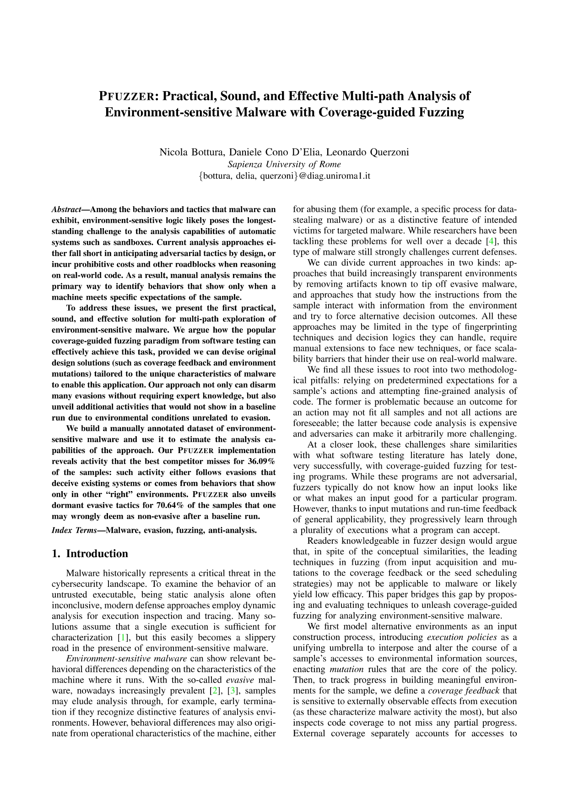
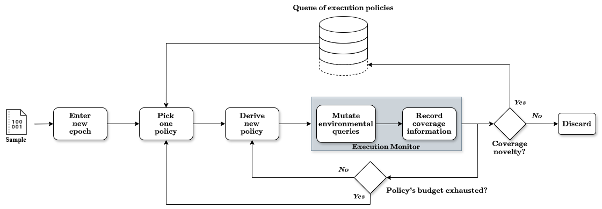

# PFuzzer - Dataset and Evaluation Artifacts

<p><a href="https://nicolabottura.github.io/assets/pdf/eurosp25-pfuzzer.pdf"></a></p>


This repository contains the evaluation materials for the PFuzzer system, including the list of samples that make up our **annotated dataset** of environment-sensitive malware, which we built and used for evaluating PFuzzer, and the **results** and insights derived from our automated and, where applicable, manual analysis of these samples.

## What is PFuzzer
PFuzzer is an academic prototype of a coverage-guided fuzzer for analyzing environment-sensitive Windows malware. You can learn more in our [paper](https://nicolabottura.github.io/assets/pdf/eurosp25-pfuzzer.pdf) *"PFUZZER: Practical, Sound, and Effective Multi-path Analysis of Environment-sensitive Malware with Coverage-guided Fuzzing"*, presented at the 10th IEEE European Symposium on Security and Privacy ([EuroS&P'25](https://eurosp2025.ieee-security.org/)).

The motivation behind PFuzzer stems from the observation that the long-stading challenges of analyzing environment-sensitive malware share similarities with problems that coverage-guided fuzzing has successfully addressed in other domains.

PFuzzer works by mutating how a sample perceives its environment and detecting meaningful differences in its execution through coverage feedback.
Our coverage mechanism relies on two complementary sources, providing a comprehensive view of the malware’s behavior:
1. *External coverage*: information about externally observable actions that the sample performs on the system, focusing on environmental queries and changes to the machine state.
2. *Internal coverage*: information about the internal program states traversed during execution.

The workflow of PFuzzer, illustrated in the [figure](#arch) below, mainly consists of:
* Mutating the environment so malware can take alternative execution paths
* Tracking coverage metrics and using them as feedback to guide exploration
* Dynamically evolving environments, prioritizing those that expose new behaviors

<p align="center">
  <a id="arch"></a>
  <br/>
  <em>Overview of PFuzzer's architecture.</em>
</p>

The methods and the system itself are covered by Italian and European patents (IT202200015966A1, EP4312401). PFuzzer may be made accessible to academic researchers on a case-by-case basis after a vetting process that requires a description of the intended use.

## Dataset
To conduct the research, we assembled a curated dataset of 1,078 PE32 samples potentially exhibiting environment-sensitive behavior. We began with over 315,000 binaries collected between 2018 and 2023 from VirusTotal’s Academic feed and the monthly Bazaar drops on VX Underground, and applied several deduplication and filtering steps to obtain a diverse yet manageable set of 1,078 samples from over 239 families.

Whenever PFuzzer’s automated analysis failed, we manually reverse-engineered the corresponding sample to identify the underlying obstacle and recorded our findings.

For full details on the dataset construction process, please refer to our [paper](https://nicolabottura.github.io/assets/pdf/eurosp25-pfuzzer.pdf).

## Repository structure

This repository is organized as follows:
```
.
├── samples
|   ├── HowToInterpretALog.md
│   ├── legend/
|   |   ├── InTraceLabels.md
|   |   ├── All_years.xlsx
│   │   ├── 2018.md
│   │   ├── 2019_05_11.md
│   │   ├── ...
│   │   └── 2023.md
│   ├── 2018/
│   │   ├── 003af1dfc65a3a7d23d4fff95bf6a04511ba2d1ef4672678c0554f74613e80d5/
│   │   │   ├── pfuzzer_output.zip
│   │   │   └── notes.txt
│   │   ├── 008d2c76a1f32388950737e6f8e98ae1518e15ced2291f13a6fb21983423f501/
│   │   │   ├── pfuzzer_output.zip
│   │   │   └── notes.txt
│   │   └── ... 
│   ├── 2019_05_11/
│   │   ├── 00e739eaebc68c8760f43194b409c9dbdf0c2011cc61778d5ed73323e93a8498/
│   │   │   ├── pfuzzer_output.zip
│   │   │   └── notes.txt
│   │   └── ...
│   └── ...
└── scripts/
    ├── unzip_traces.sh
    └── zip_traces.sh
```

Each sample is stored in its own subdirectory under the corresponding year (inside `./samples/`).
A sample directory always contains:
* *pfuzzer_output.zip*: compressed execution traces generated by PFuzzer. These can be extracted using the helper script `scripts/unzip_traces.sh`.
* *notes.txt*: formatted findings derived from the traces, along with additional manual annotations when available.

The document [HowToInterpretALog](samples/HowToInterpretALog.md) provides an example describing how to interpret PFuzzer's logs.  
We recommend reading first the document [InTraceLabels](samples/legend/InTraceLabels.md), which details each label used within a trace and its structure.

Within `./samples/legend/`, we provide the categorized sample overview in two formats: one Markdown file per year (e.g., `2018.md`) and a single Excel workbook (`All_years.xlsx`) containing one sheet per year. Both follow the categorization described in Section 5.1 of our paper.

## Contributors
PFuzzer is the result of research by [Nicola Bottura](https://nicolabottura.github.io/) and [Daniele Cono D'Elia](https://www.diag.uniroma1.it//~delia/).

If you wish to cite this work, you can use the following BibTeX entry:

```
@inproceedings{bottura2025pfuzzer,
  title={{PFUZZER}: Practical, Sound, and Effective Multi-path Analysis of Environment-sensitive Malware with Coverage-guided Fuzzing},
  author={Nicola Bottura and Daniele Cono D'Elia and Leonardo Querzoni},
  booktitle={Proceedings of the 10th IEEE European Symposium on Security and Privacy (IEEE EuroS\&P '25)},
  pages={1121-1139},
  year={2025},
  publisher={IEEE}
}
```

## Acknowledgements
This work has partially been supported by project [SERICS](https://serics.eu/) (PE00000014) under the MUR National Recovery and Resilience Plan funded by the European Union - NextGenerationEU.
